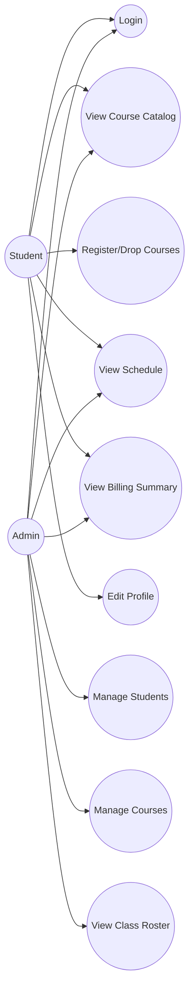
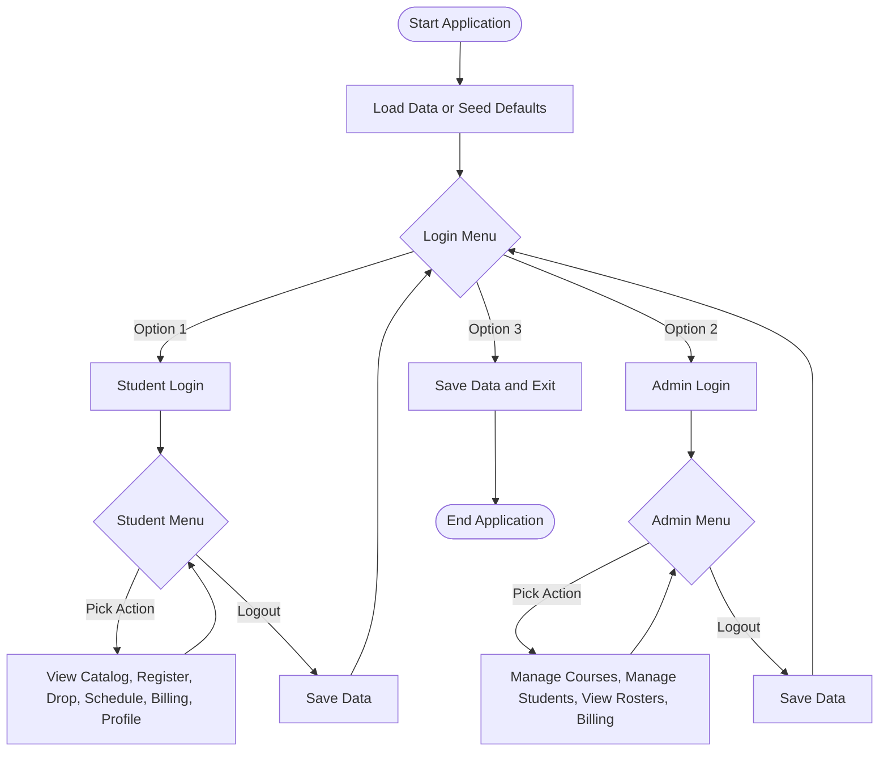

# unknownapp
This is an unknown application written in Java

---- For Submission (you must fill in the information below) ----
### Use Case Diagram

### Flowchart of the main workflow

### Prompts
1. "Execute this code. i want to know what program does"
2. "Try to execute it, read the code, and understand what the program does. Create a use case diagram that shows the program's functionality. Put the use case diagram in the README.md. Create a flowchart (using Mermaid) to show the user's flow through the main menu. Put the flowchart in the README.md. Based on what you understand about the program, select one use case and create an equivalent Python version of the program. Put the Python program in a new folder called python. You can use AI to help you on this, but you must put the prompts you used in the README.md under the section # Prompts. Commit the code and push to the repository. Put the URL of your forked repository in the provided box below."
